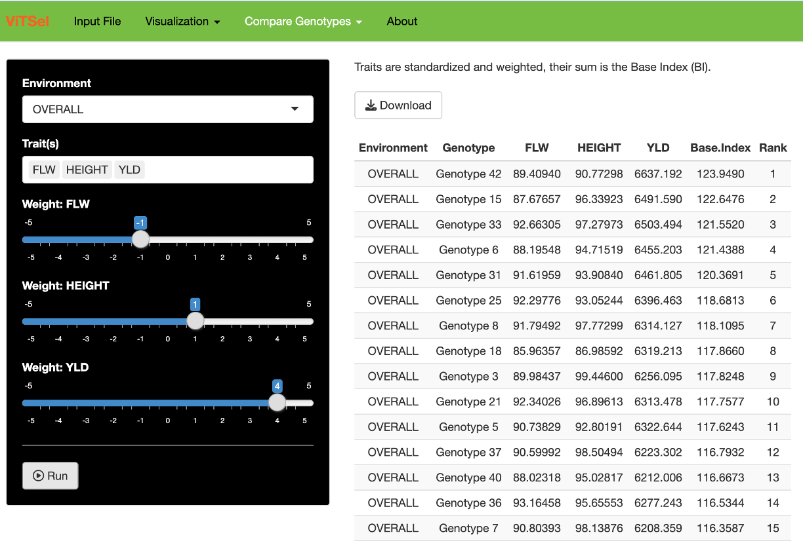

ViTSel
================

## Visualization Tool for Selection

A decision-support tool to ease selection by visualizing results of a
multi-environmental, multi-trait analysis

Given a matrix of genotypes by environments in rows and traits in
columns, it produces several descriptive statistics and visualizations
to explore results. It has the capability of defining different criteria
to identify the best genotypes.

## Rationale

- Outputs of statistical analysis are usually performance of genotypes
  in single or group of environments

- Question: how to consider these outputs to allow breeders after
  running analytics to quickly (and easily?) take decision?

- One option is to consider selection indices in which several traits
  are considered simultaneously

- We developed an Shiny-based app running in an interactive
  visualization environment to facilitate/automatize the process using
  index selection

 

## Input Data

- The input data are entry means (often BLUPs) derived from statistical
  analysis (Linear Mixed Model).

 

## Selected screenshots

   

   

   

   

## Authors

- Ibnou Dieng (IITA, Nigeria) - ORCID: 0000-0002-1051-9143

- Francisco Rodríguez (CIMMYT, Mexico)

- Gregorio Alvarado (CIMMYT, Mexico)

- Ángela Pacheco (CIMMYT, Mexico)

- Juan Burgueño (CIMMYT, Mexico) - ORCID: 0000-0002-1468-4867
